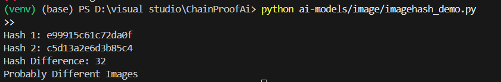

🧠 What is a Hash Algorithm?
A hash algorithm is like a digital fingerprint for any file (small or huge). It takes all the data in a file and produces a short fixed-length string (like 32 or 64 characters) called a hash.
👉 This hash summarizes the whole file — even though it's tiny in size.
📂 Large file → 🔁 Processed by hash algorithm → 🔐 Small code = "hash"

🧪 Why Use a Hash?
Imagine you’re sending a super important file 📄 — like:
✅ “Permission to Go to the Moon 🚀”

You want to make sure that:
      The file wasn’t changed by anyone
      The file didn’t get damaged during transfer

🧩 What You Do:
You send two things:
       ✅ The file
       🔐 A hash of the file (like a secret code made from the file)

🎯 What the Receiver Does:
         When the receiver gets the file, they don’t just trust it.
         Instead, they:
        Run the same hash algorithm on the file they got
        Compare it to the hash you sent
        ✅ If the hashes match:
        It means the file wasn't changed
        So it's safe to use
        ❌ If the hashes don’t match:
        It means something is wrong
        Maybe someone changed the file
        Or maybe it got damaged during transfer

🔍 Real-Life Example (Bar Code or Credit Card):
Let’s talk about a credit card:

A credit card has many digits, like:

1234 5678 9012 3456
👉 The last digit (6 in this example) is not random. It’s a check digit — calculated using the other digits.

If someone mistypes even one digit, like:

1234 5678 9012 345**7**
Then the check digit (6) won’t match the rest → ❌ Error!

So, it's a quick way to check for mistakes — just like a hash checks if a file is correct.

🧪 What Makes a Good Hash Algorithm?
    1. ✅ Fast, But Not Too Fast:
    It should hash files quickly (within seconds), but not too fast.

    If it's too fast, hackers can try millions of changes quickly to break it.

    2. ⚡ Avalanche Effect:
    If you change even 1 tiny bit in the file (like a comma), the entire hash changes completely.

    Example:

    Original file → 7e245aa934b...

    Changed file → d91b1a2097d... (looks totally different)

    3. 🚫 No Collisions:
    Hash collision = Two different files having the same hash ❌

    That would be dangerous! A hacker could create a fake file with the same hash as an important one.

    Think: “2 people having same fingerprint” — not safe!

    Mathematically, it can happen (due to the pigeonhole principle), but it should be extremely rare and nearly impossible to force.

    

⚠️ Real Security Risks — Let's Understand This Step by Step:
🔓 1. MD5 – An Old Hash Algorithm
MD5 was a very popular hash algorithm used to check file integrity.

But now it’s considered broken.

❗ Why?
Because hackers have figured out how to:

Create fake files that give the same MD5 hash as a real file.

This is called a collision.

Two totally different files → same hash. That’s dangerous.

Search MD5 hashes on Google and get the original data.

MD5 was used so much, and many MD5 hashes are publicly known.

So if someone stores your password’s MD5, hackers can find out what the real password is — by Googling the hash!

Example:
If your password is "apple123" → MD5 = e99a18c428cb38d5f260853678922e03
Anyone can search this MD5 on Google and find “apple123” as the original text.

👉 So, MD5 is no longer secure. Don't use it.

🔒 2. Better Options:
Algorithm	Status
MD5	❌ Broken
SHA-1	⚠️ Weak (nearly broken)
SHA-2	✅ Secure today
SHA-3	✅ Super secure, still being adopted

🤔 3. Why You Shouldn’t Use Hashes to Store Passwords
Hashing = good for checking files.
But not good for passwords. ❌

Why?
Because hash algorithms like MD5, SHA-1, SHA-2 are:

⚡ Too fast

That means a hacker can try:

Millions of possible passwords per second (called a brute force attack).

Eventually, one of them matches your hash → password stolen.

✅ What to Use Instead?
For storing passwords, use special slow hashing algorithms that are built for security:

Algorithm	Purpose	Good For
bcrypt	🛡️ Secure, slow hash	Passwords
scrypt	💾 Uses memory too	Passwords
Argon2	🥇 Most secure today	Passwords

These are slow by design, which makes brute force attacks hard for hackers.

⚠️ 4. A Bad Practice — "Here's the Hash of Our Software"
Sometimes websites say:

“Download our app, and here’s the hash. If it matches, it's safe!”

❗Why this is not safe:
Let’s say a hacker breaks into their website:

They replace the software file with a hacked version (e.g., with a virus)

And also change the hash shown on the page to match the fake file

So you, as a user:

Download the bad file

Check the hash → It matches ✅

But it's still a hacked, dangerous file! 😱

👉 Hashes only tell you:
“The file downloaded correctly — no bits got lost or changed.”

They don’t tell you:

“This file is safe and trusted.”

🧠 1. What is Image Hashing?
✅ Definition:
Image hashing is the process of converting an image into a unique, fixed-size fingerprint (called a hash) that represents its visual content.

This fingerprint allows you to compare images efficiently.

🔁 Example:
If two images are:

Exactly the same → hashes will be identical

Slightly modified (filtered, cropped, resized) → hashes will be close but not the same

💡 Why Not Use Normal Hashing (like SHA256)?
Technique	Behavior
SHA256	Completely different hash if even 1 pixel changes
Image Hashing	Still gives a similar hash if the image looks similar

So, image hashing is visual-aware, unlike general hashing.

✅ 2. Why Use Image Hashing in Our Project?
In ChainProof AI, our goal is to:

🎨 Detect if someone stole or reused an image with minor edits (filters, cropping, compression).

To do this, we need a method that:

✅ Can generate a fingerprint of the original image

✅ Still matches similar images even if they are slightly changed

That’s why we use Image Hashing:

It’s fast

It’s lightweight

It helps track visual similarity

It works even with basic image tampering

🧠 3. What is Perceptual Hashing?
✅ Definition:
Perceptual Hashing is a type of image hashing that:

Extracts the visual structure (edges, brightness, layout) of an image instead of the exact pixel values.

It simulates how the human eye sees — so even if the image has:

Color filters

Resize

Rotation

Compression artifacts
➡️ The perceptual hash will still be close to the original.

🔧 Algorithms of Perceptual Hashing:
Used in the imagehash library:

Method	How it Works	Strength
aHash	Uses average pixel brightness	Fast, basic
pHash	Uses DCT (frequency-based features)	✅ Best for image similarity
dHash	Uses difference between adjacent pixels	Good for edge detection
wHash	Uses Wavelet transform	Very strong, slower

🔍 Why We Use Perceptual Hashing in ChainProof AI?
Because:

🎯 Our goal is to detect image misuse — even after edits, reposts, compressions, or filters.

So we need a hash that:

✅ Tolerates slight modifications

✅ Still gives close values if the visual content is the same

✅ Can compare two hashes and say: "This image is reused!"

That’s exactly what pHash (perceptual hash) does.

✅ Summary
Topic	Explanation
Image Hashing	Makes a fingerprint from an image
Why in Project?	To detect reused/edited images
Why Perceptual Hashing?	It focuses on visual content, not exact pixels
Algorithm Used	imagehash.phash() — best balance of speed and accuracy
What it helps do	Detect image theft across platforms (Instagram, YouTube, etc.)

COMPLETE OVERVIEW OF DAY1:
# 📘 Day 1 – Image Hashing (pHash)

## 🔍 What I Did
- Set up virtual environment and installed dependencies
- Learned about hashing and image hashing
- Implemented perceptual hashing (pHash) using imagehash
- Tested with original and filtered/cropped images

## 🧠 Concepts Learned
- Hashing basics (MD5 vs Perceptual Hash)
- How pHash works using DCT
- Hamming distance for similarity check
- pHash is good for filters, compression
- Fails on cropping or major edits

## 🔬 Observations
- Identical or filtered images → small hash difference
- Cropped or contrast-changed images → large difference
- Set threshold: if `abs(hash1 - hash2) <= 10`, consider reused

## ✅ What’s Next
- Use OpenCV SIFT keypoint matching
- Detect image reuse when pHash fails (e.g., cropping/rotation)

OUTPUT:

