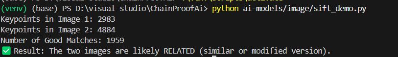

🧠 What is OpenCV?
OpenCV stands for Open Source Computer Vision.

📦 It is a Python library that helps us:
Read and display images or videos

Edit or manipulate them (rotate, crop, resize, blur, etc.)

Detect objects, faces, features in images

Do computer vision tasks like fingerprinting, object tracking, facial recognition, etc.

📌 In simple terms:
OpenCV is like Photoshop + AI tools, but in Python code.

🎯 What is SIFT?
SIFT = Scale-Invariant Feature Transform

This is a powerful feature detection algorithm inside OpenCV.

Let’s break that scary name into parts:

Part	Meaning
Scale-Invariant	It works even if the image is resized (zoomed in/out)
Feature	It looks for important points in the image (like corners, edges)
Transform	It converts those features into descriptors (numbers)

🧩 Imagine This:
Let’s say we have this image of a sunflower:

🌻 Original Image
Now imagine all these edits:

🌻 Rotated

🌻 Cropped

🌻 Zoomed

🌻 Slightly blurred

🌻 Changed brightness

Humans can still recognize it’s the same image, right?

But normal algorithms like pHash might fail.

That’s where SIFT helps:
💡 It finds specific keypoints on the sunflower (e.g., petal edges, center) that don’t change with rotation, cropping, resizing.

📌 What SIFT does in steps
Let’s say we run SIFT on an image:

1. 🧭 Keypoint Detection
It finds interesting points in the image — like corners, blobs, or edges.

📸 These are called keypoints.

Example:

"This corner is very distinct" → Mark it
"This edge is unique" → Mark it
2. 🧮 Descriptor Extraction
For each keypoint, SIFT creates a 128-length vector of numbers.

This vector describes:

the gradient direction

edge intensity

local structure

Think of this as a fingerprint of that region.

3. 🔗 Matching Descriptors Between Images
Now, if we run SIFT on two images (even if one is cropped or rotated), we can:

Compare the descriptors from both

See how many match

Say: “These two images are likely the same or related!”

💡 What SIFT does (Simple Version)
SIFT is a smart AI algorithm that says:

1️⃣ “Let me find important points in the image”
These are called keypoints:

Like the corner of a petal 🌸

The center of the flower 🌻

A sharp edge of a leaf 🍃

SIFT finds hundreds of such keypoints in a single image!

2️⃣ “For each point, I’ll create a tiny signature”
This is called a descriptor — just a fancy word for a 128-number fingerprint.

So each keypoint has a fingerprint like:

[0.12, 0.44, 0.87, ... 125 more numbers]
Why 128? That’s just the way SIFT works. It describes:

Edge direction

Intensity

Gradient change

3️⃣ “Now I can compare two images easily”
SIFT says:

“If image A and image B have many matching fingerprints, then they are related — even if cropped, zoomed, or rotated.”

It uses a tool called BFMatcher (Brute Force Matcher) to:

Compare every point in image 1 to every point in image 2

Then keep only the best matches using Lowe’s Ratio Test

✅ Real-Life Example: Comparing Two Images
Let’s say we run SIFT on:

📷 image1.jpg = clear photo of Taj Mahal
📷 image2.jpg = rotated + cropped version

SIFT will say:

🔍 Found 520 keypoints in image1
🔍 Found 480 keypoints in image2
✅ Matched 320 keypoints — these images are probably the same

That's how SIFT helps ChainProof AI detect stolen or reposted content.

🤔 Key Terms You Must Remember
Term	Meaning (in simple words)
OpenCV	Python library to work with images and videos
SIFT	Finds special points in an image that stay the same even after cropping or rotating
Keypoint	An important part of the image (corner, edge, blob)
Descriptor	128-number fingerprint of that point
BFMatcher	Tool to compare descriptors from 2 images
Lowe’s Test	Filters out bad or weak matches

OUTPUT:
